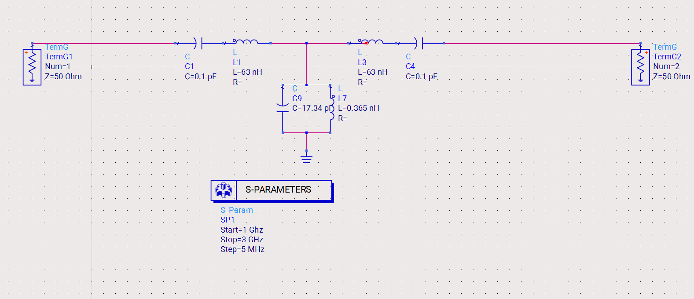
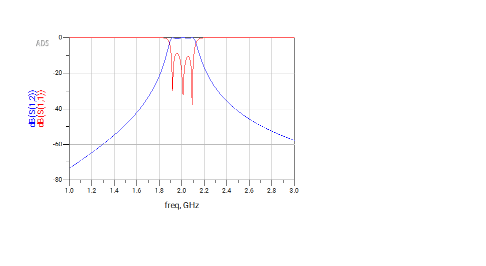
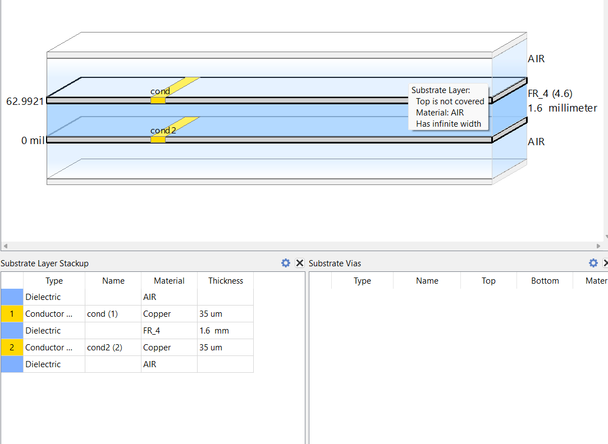
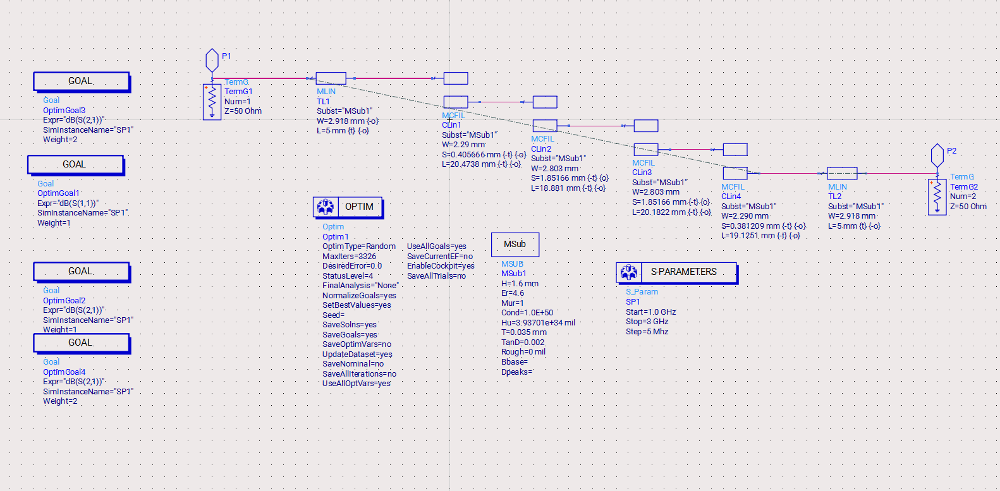
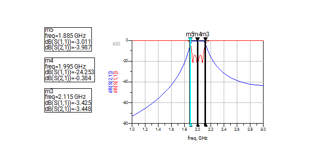
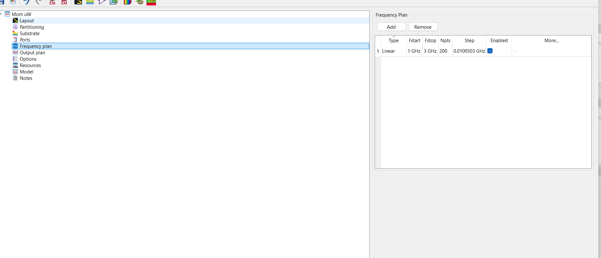
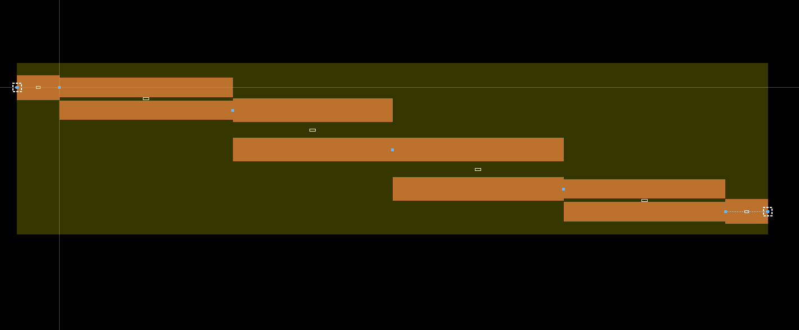
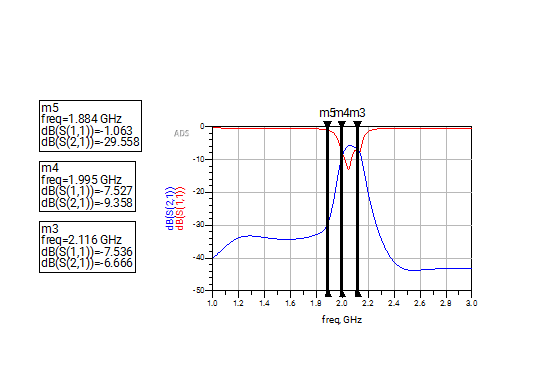

# 2 GHz Bandpass Filter Design — Keysight ADS

A 3rd-order Chebyshev bandpass filter centered at **2 GHz**, designed and simulated in **Keysight ADS**.  
Covers the complete design pipeline: mathematical prototype derivation → lumped element model → microstrip coupled-line conversion → full-wave EM simulation.

---

## Specifications

| Parameter | Value |
|-----------|-------|
| Filter Type | Bandpass |
| Approximation | Chebyshev |
| Order (n) | 3 |
| Center Frequency (f₀) | 2 GHz |
| Passband | ~1.885 – 2.115 GHz |
| Port Impedance (Z₀) | 50 Ω |

---

## Design Flow

```
Chebyshev Prototype
       ↓
Lumped Element BPF (frequency + impedance scaled)
       ↓
Microstrip Coupled-Line BPF (odd/even mode method)
       ↓
ADS Optimizer (random, dimension fine-tuning)
       ↓
EM Simulation (ADS Momentum MoM)
```

---

## Step 1 — Chebyshev Prototype Values

The normalized lowpass prototype values for a 3rd-order Chebyshev filter are calculated using:

```
β  = ln(coth(LAr / 17.37))       where LAr is the passband ripple
γ  = sinh(β / 2n)
aₖ = sin[(2k-1)π / 2n]           k = 1, 2, 3, ..., n
bₖ = γ² + sin²(kπ / n)           k = 1, 2, 3, ..., n

g₁ = 2a₁ / γ
gₖ = (4aₖ₋₁aₖ) / (bₖ₋₁gₖ₋₁)    k = 2, 3, ..., n
gₙ₊₁ = 1                          for n odd
     = coth²(β/4)                 for n even
```

**Resulting prototype values:**

| Element | Value |
|---------|-------|
| g₁ | 1.5963 |
| g₂ | 1.0967 |
| g₃ | 1.5963 |
| g₄ | 1.0000 |

The symmetry (g₁ = g₃, g₄ = 1) confirms a 3rd-order Chebyshev with equal ripple and matched terminations.

---

## Step 2 — Lumped Element Bandpass Filter

The prototype values are frequency and impedance scaled to produce a bandpass filter centered at f₀ = 2 GHz with Z₀ = 50 Ω.

**Scaling relations:**

```
Δ = (ω₂ - ω₁) / ω₀        (fractional bandwidth)

Series arm (from shunt prototype element Cₖ):
  L'ₖ = Lₖ·Z₀ / (ω₀·Δ)
  C'ₖ = Δ / (Lₖ·Z₀·ω₀)

Shunt arm (from series prototype element Lₖ):
  L'ₖ = Δ·Z₀ / (ω₀·Cₖ)
  C'ₖ = Cₖ / (Z₀·Δ·ω₀)
```

**Resulting lumped element values:**

| Component | Value |
|-----------|-------|
| L₁ = L₃ | 63 nH |
| C₁ = C₃ | 0.1004 pF |
| L₂ | 0.365 nH |
| C₂ | 17.34 pF |

**Topology:** Two series LC resonators (L1-C1 and L3-C3) in the main signal path, with a shunt parallel LC resonator (L2 ∥ C2) to ground at the center node.

### Lumped Element Schematic


### Lumped Element S-Parameter Response


S-parameter sweep: 1–3 GHz, step 5 MHz. Clean passband centered at 2 GHz with deep stopband rejection.

---

## Step 3 — Microstrip Coupled-Line Conversion

The lumped BPF is converted to a physically realizable microstrip coupled-line bandpass filter using the **odd/even mode impedance method**.

Each coupled-line section supports a resonant mode at the center frequency, with electrical length = 90° at f₀ = 2 GHz.

**Odd/Even mode impedances** for each section are derived from the prototype g-values and fractional bandwidth Δ:

```
Z₀ₑ,ₖ = Z₀ [1 + Jₖ·Z₀ + (Jₖ·Z₀)²]
Z₀ₒ,ₖ = Z₀ [1 - Jₖ·Z₀ + (Jₖ·Z₀)²]
```

where Jₖ are the inverter values derived from the prototype elements.

### Substrate Parameters

| Parameter | Value |
|-----------|-------|
| Material | FR4 |
| Dielectric Constant (εᵣ) | 4.6 |
| Substrate Thickness (H) | 1.6 mm |
| Conductor | Copper |
| Conductor Thickness (T) | 35 µm |
| Loss Tangent | 0.002 |
| Electrical Length | 90° at 2 GHz |

### Coupled Line Section Dimensions

| Section | Zoe (Ω) | Zoo (Ω) | Width (mm) | Spacing (mm) | Length (mm) |
|---------|---------|---------|------------|--------------|-------------|
| 1 | 70.61 | 39.24 | 2.290 | 0.491 | 20.723 |
| 2 | 56.64 | 44.77 | 2.803 | 1.804 | 20.255 |
| 3 | 56.64 | 44.77 | 2.803 | 1.804 | 20.255 |
| 4 | 70.61 | 39.24 | 2.290 | 0.491 | 20.723 |

Feed lines (TL1, TL2): W = 2.918 mm, L = 5 mm (50 Ω microstrip)

The symmetry of sections 1↔4 and 2↔3 is consistent with the symmetric Chebyshev prototype.

### Substrate Stackup


### Microstrip Schematic (with Optimizer)


---

## Step 4 — ADS Optimization

Post-conversion, a **random optimizer** was run in ADS to fine-tune the coupled line dimensions and compensate for discontinuity effects not captured by the analytical conversion.

| Parameter | Value |
|-----------|-------|
| Optimizer Type | Random |
| Max Iterations | 3326 |
| Goals | S(1,1) minimization + S(2,1) passband flatness |
| Weight (S(1,1)) | 1 |
| Weight (S(2,1)) | 1–2 |

Final optimized dimensions deviate slightly from hand-calculated values — refer to schematic for exact post-optimization values.

### Microstrip S-Parameter Response (Post-Optimization)


| Marker | Frequency | S(1,1) | S(2,1) |
|--------|-----------|--------|--------|
| m5 | 1.885 GHz | -3.011 dB | -3.987 dB |
| m4 | 1.995 GHz | -24.253 dB | -0.384 dB |
| m3 | 2.115 GHz | -3.425 dB | -3.448 dB |

---

## Step 5 — EM Simulation (ADS Momentum)

Full-wave electromagnetic simulation performed using **ADS Momentum (MoM microwave)** to validate the physical layout accounting for conductor losses, fringing fields, and substrate parasitics.

### EM Simulation Setup


### EM Layout


The staggered coupled-line layout is visible — 4 sections offset diagonally, consistent with the interdigital/coupled-line topology.

### EM Frequency Plan

| Parameter | Value |
|-----------|-------|
| Solver | Momentum Microwave (MoM) |
| Sweep Type | Linear |
| Fstart | 1 GHz |
| Fstop | 3 GHz |
| Points | 200 |
| Step | ~10 MHz |

### EM Simulation Response


| Marker | Frequency | S(1,1) | S(2,1) |
|--------|-----------|--------|--------|
| m5 | 1.884 GHz | -1.063 dB | -29.558 dB |
| m4 | 1.995 GHz | -7.527 dB | -9.358 dB |
| m3 | 2.116 GHz | -7.536 dB | -6.666 dB |

> **Note:** The EM response shows degradation compared to the circuit-level simulation. This is expected — Momentum captures conductor losses, fringing fields, and substrate effects that the ideal coupled-line circuit model does not account for. The passband shift and insertion loss increase are primarily attributed to FR4's non-negligible loss tangent (0.002) at 2 GHz and mesh resolution in the current simulation setup. A finer mesh and substrate refinement would improve accuracy.

---

## Results Summary

| Stage | Center Freq | S(2,1) at f₀ | Passband BW |
|-------|-------------|--------------|-------------|
| Lumped Element | ~2 GHz | ~0 dB | ~230 MHz |
| Microstrip (optimized) | 1.995 GHz | -0.384 dB | ~230 MHz |
| EM Simulation | 1.995 GHz | -9.358 dB | degraded |

---

## Repository Structure

```
2GHz-BPF-ADS/
├── images/
│   ├── lumped_sch.png
│   ├── lumped_sparameters.png
│   ├── mspc_sch.png
│   ├── mspc_sch_sparameters.png
│   ├── substrate.png
│   ├── em_setup.png
│   ├── layout.png
│   └── layout_em_sim.png
├── calculations/
│   └── prototype_calculations.pdf
└── README.md
bpf calculations
```

---

## Tools Used

- **Keysight ADS** — schematic entry, S-parameter simulation, random optimizer, Momentum EM
- Design methodology: Pozar — *Microwave Engineering*, Chapter 8

---

## Author

Self-initiated RF filter design project exploring microwave filter theory and simulation.
